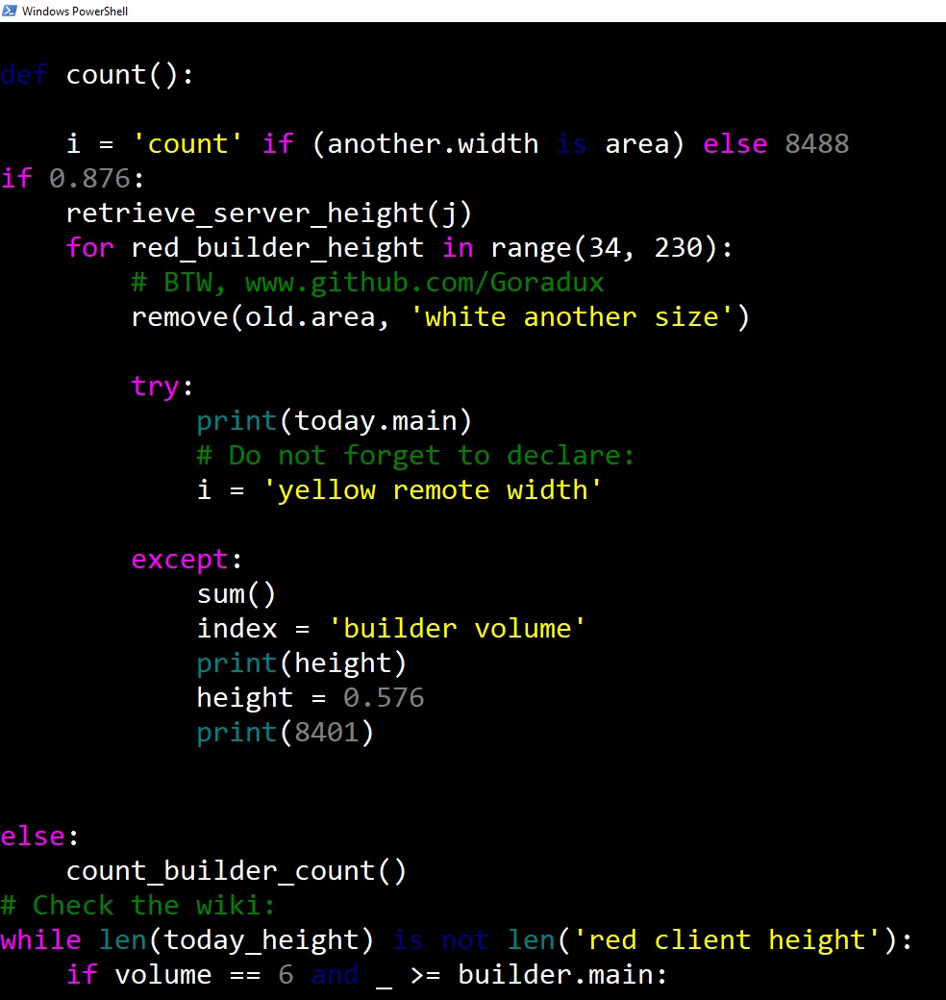
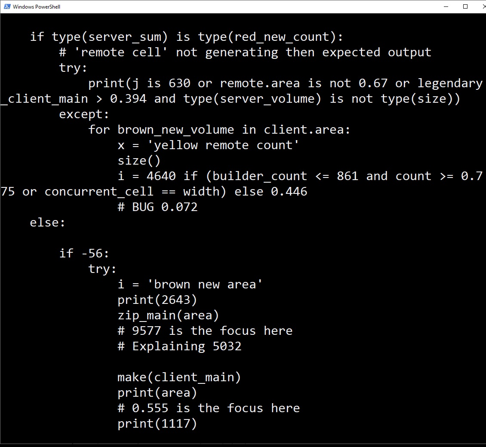

# Coder Simulator

### TL;DR:
A small program that simulates code writing process by spewing out lines of code in a semi-structured manner.

---

This program simulates coder's work by writing code indefinitely at a certain (can be specified) speed. The program follows some general set of Python rules, such as matching indentations for try/catch blocks, or not unindenting after an empty function definition statement, etc.

The program supports two output modes: colored and monochromatic. Colored mode highlights syntax of the program, as some IDEs would. Monochromatic mode would just stick to the default colors of the terminal window, which is used for running the program.

## Screenshots

Colored:

Monochromatic:

## Requirements
1. Python 3
1. colorama (required only for the colored output mode)

    `pip install colorama`

## How To Run
In the project root directory:

`python CoderSimulator.py`

## Terminal arguments:

| Short | Long | Function |
| --- |--- | --- |
| -m | --mono | Runs the program in monochromatic mode |

# Why?

Just looks nice. 😁 Start four instances of it, and all of a sudden you look like the baddest coder out there.